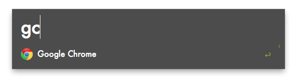
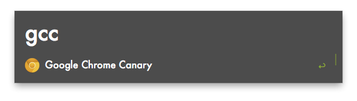
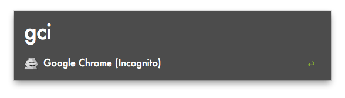
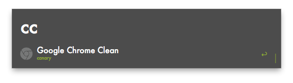
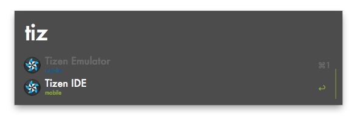
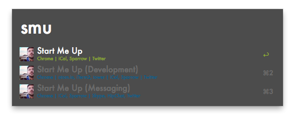

[Alfred App](http://www.alfredapp.com/)

# Workflows

## terminal
* `terminal` iTerm2
* `terminal + ⌃` Terminal

## Chrome
* `gc` Google Chrome

* `gcc` Google Chrome Canary

* `gci` Google Chrome (Incognito)

* Open clean installed *webkit* browser - no extensions, no sync
    * `cc` Google Chrome Canray
    * `cc + ⌃` Google Chrome
    * `cc + ⌥` Chromium

## Tizen
* Tizen Emulator
    * `tizen` Tizen Emulator (mobile)
    * `tizen + ⌃` Tizen IDE (wearables)
* Tizen IDE
    * `tizen` Tizen IDE (mobile)
    * `tizen + ⌃` Tizen IDE (wearables)

## iOS Simulator
* `ios` iOS Simulator

## Android SDK

## Start Me Up
* `smu` Start Me Up
* `smu dev` Start Me Up + development tools
* `smu msg` Start Me Up + messaging apps

# Theme

