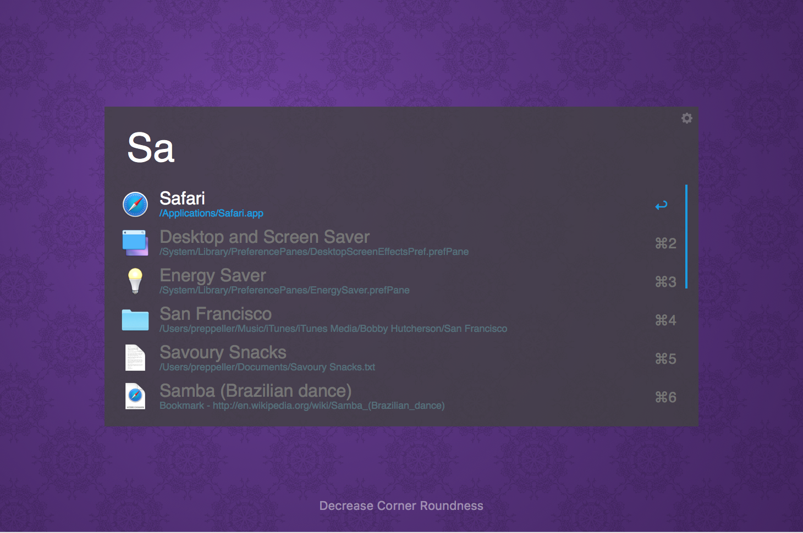

# Alfred Workflows

## Workflows
The workflows I use with [Alfred App][@alfredapp]

### About This Mac
[About This Mac](http://www.alfredforum.com/topic/2025-about-this-mac/) by Rodger WW

### apps
Hotkeys for
* [Atom](https://atom.io/)
* [Commander One](http://mac.eltima.com/file-manager.html)
* [iTerm](https://www.iterm2.com/)

### Chrome
* `gci` Google Chrome (Incognito)

* `gcc` Open clean installed *webkit* browser - no extensions, no sync
    * `gcc` Google Chrome
    * `gcc + ⌃` Google Chrome Canray
    * `gcc + ⌥` Chromium

### GitHub commands
[GitHub commands](https://github.com/gharlan/alfred-github-workflow) by [@gharlan](https://github.com/gharlan)

### Hidden Files (customized)
Original [Toggle Hidden Files](http://www.packal.org/workflow/toggle-hidden-files) by [@milanvanzanten](https://github.com/milanvanzanten)

### Keeping You Awake (customized)
Original [Activate Keeping You Awak](http://www.packal.org/workflow/activate-keeping-you-awake) by [@KyleKing](https://github.com/KyleKing)

## Themes
The themes I use with [Alfred App][@alfredapp]

### Material Dark

### Material Light

[@alfredapp]: http://www.alfredapp.com/
